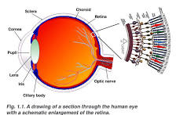
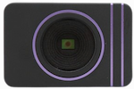

# Event camera's and their required software

## What Is an Event Camera?

### Intro
An event camera is a new type of device known as a neuromorphic sensor that mimics the way retnas capture light, neuromorphic meaning "brain-like." The camera, just like the retenas, captures changes in brightness rather than the absolute brightness of a given scene. 



### Camera Functionality
Expanding on the functionality of the event camera away from it's biological analog, (pun intended), the pixels are asynchronous from a frame with discrete intervals, meaning each pixel that comes in is random (stochastic). Each pixel is then associated with the following:
1. x and y position of the "frame"
2. timestamp of the given pixel in microseconds
3. polarity of the pixel

This breeds a new idea of how we run algorithms with the event camera from conventional, convolutional based methods with frames with fixed frame rates. 

>While the pixels are asynchronous, there is still a fixed frame width and height like any other digital camera.

### DVXplore Event Camera (our camera)



The [DVXplore](https://docs.inivation.com/hardware/current-products/dvxplorer.html) is a 640x480 pixel event camera with a maximum output of 165MEPS (mega events per second) and maximum dynamic range of 90-110dB
>For more information click on the link to read the docs


## Git initialization

### ssh key creation

```bash
ssh-keygen -t ed25519 -C "your_email@example.com"

```
Hit enter to put it in ~/.ssh/id_ed25519
Make a passphrase that you will remember to access it
```bash
eval "$(ssh-agent -s)"
ssh-add ~/.ssh/id_ed25519

```
Enter the passphrase

```bash
cat ~/.ssh/id_ed25519.pub
 
```
copy the output of that command and paste it in github.com

1. click on profile 
2. go to accessibility
3. go to SSH and GPG keys
4. click add key and name it something
5. paste the key that you copied from shell terminal

```bash
# test connection
ssh -T git@github.com

```
If connection successful, clone repo

```bash
git clone git@github.com:Relativity1395/evnt_work.git

```

## Installing dependancies for git repository

```bash
git clone git@github.com:Relativity1395/evnt_work.git

sudo apt-get install build-essential cmake pkg-config libusb-1.0-0-dev

cd libcaer

cmake -DCMAKE_INSTALL_PREFIX=/usr .

make

sudo make install

```

```bash
sudo apt install -y libopencv-dev python3-opencv
```
next go into the group repo and make a build folder
```bash
cd evnt_work

mkdir build && cd build

cmake ..

make

./dvxplore_simple

```
To run the script with optical flow filter, comment out "show raw events" line 28


