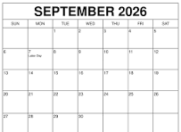
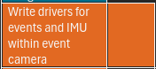
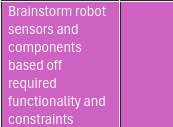
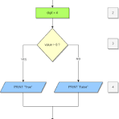

# Week One of Senior Design

## Goals for today

### Everyone
1. Discuss schedule
2. Discuss updates
3. Get repository working on everyone's VM
4. Give demo of current progress

### Devs 
1. Discuss tasks for the software team for the week 
2. Install libcaer repository
3. Review drivers for event camera and how they work
4. Find IMU drivers from the libcaer repo and integrate it into out workspace 
5. Output accelerometer and gyro values from camera

### Robotics team
1. Discuss desired behaviors for the robot outside the algorithms
2. Search for according parts 
3. Add parts to order sheet
4. Learn ROS 

### Researchers
1. Give in depth lecture on entire workflow for feature detection and optical flow algorithm
2. Go over research paper and discuss each important algorithm while creating a block diagrams for the devs
3. Find other papers possibly for the same topic

## Current updates:
### Simple Feature detector
I have found a feature detector library that is used for the first step of feature detection for the feature-optical flow pipeline:
```bash
cd ~/evnt_ws/third_party/fast_detector.cpp

```
### Feature visualizer
I have also made a visualizer for the detected features in dvx_drivers.cpp, I might remove that after this to keep the repo clean but we know it's there
**Queue demo for visualizer**


## Schedule September


We are in week one of september and this is where we are on the Gannt chart:






## Current Tasks


### Week 1 Devs: (current week)

**Devs**: In the repository exists drivers for the event camera including a visualizer for the events 

```bash
cd evnt_work

mkdir build && cd build 

cmake ..
make

./dvxplore_simple
```

We now need APIs to access the drivers for the IMU which can be found in libcaer.

```bash
# For .cpp files:
code ~/libcaer/examples/dvxplorer.cpp
# For .c files:
code ~/libcaer/src/dvxplorer.c

# To see the entire source tree:
code ~/libcaer

```
The IMU drivers can be found somewhere in here and look similar to the formatting of the ones found in our repository under dvx_drivers.cpp.

```bash
code ~/evnt_work

# To be specific
vim ~/evnt_work/src/dvx_drivers.cpp

```
**Review these drivers for more guidance and find the correct IMU drivers**

Once you find the correct drivers:

**test them out**
Paste them into a random file and gather all of the dependancies required (usually just libcaer/libcaer.h)
```C++
int main(void){
    //test drivers in main
}


```

To compile, place the executable in this line of CMakeLists.txt and remove dvx_drivers.cpp for now:
```cmake
add_executable(dvxplore_simple  third_party/fast_detector.cpp src/imu_test.cpp)
```

If there are no more libraries to add it should compile with the following commands after saving, however, if there are consult claude on how to update the CMakeLists.txt file

```bash
cd ~/evnt_work/build
cmake ..
make

./dvxplore_simple

```

Once drivers work:

1. Add them to the repository in evnt_work and make two files: /src/dvx_drivers.cpp and /src/dvx_drivers.h
2. If for example they come in a function, add that specific function to the files:
```C++
//dvx_drivers.cpp
int getIMU(uint16_t signal){
    ...
}

//dvx_drivers.h
int getIMU(uint16_t signal);
```
3. 
4. If they come in multiple functions such as the event drivers in a loop, package them into a single function that returns a structure of the values:
```C++
event_t get_events(caerPolarityEventPacket polarity, int j){
    event_t evnt;

    caerPolarityEvent evt = caerPolarityEventPacketGetEvent(polarity, j);
    if (!caerPolarityEventIsValid(evt)){
        exit(EXIT_FAILURE);
    }

    evnt.x = caerPolarityEventGetX(evt);
    evnt.y = caerPolarityEventGetY(evt);
    evnt.p = caerPolarityEventGetPolarity(evt);
    evnt.t = caerPolarityEventGetTimestamp64(evt, polarity);

    return evnt;
}
```
For example, if there are two separate functions to get accel and gyro, put them inside of one struct just like I have in the example with each field of the event (x, y, t, p).

5. Clean it up a bit, replace the functions within the loop that consist of the accelerometer and gyro values with the cleaner API
```C++
while...{
    get_imu(int x);
}

```
6. If possible, try to fit IMU API within the main loop of main in dvx_drivers so events can be called along with IMU drivers
```C++
while (!globalShutdown.load(std::memory_order_relaxed)) {
            canvas.setTo(cv::Scalar(0, 0, 0));
            caerEventPacketContainer packetContainer = caerDeviceDataGet(dvxplr_hndl);
            if (packetContainer == NULL) {
                // if (cv::waitKey(1) == 27) globalShutdown.store(true);  // ESC
                continue;
            }

            int32_t packetNum = caerEventPacketContainerGetEventPacketsNumber(packetContainer);

            
            int radius = 1;
            int thickness = -1;

        // Two for loops for getting the packets and events
            for (int32_t i = 0; i < packetNum; i++) {
                caerEventPacketHeader packetHeader =
                    caerEventPacketContainerGetEventPacket(packetContainer, i);
                if (packetHeader == NULL) continue;
                if (caerEventPacketHeaderGetEventType(packetHeader) != POLARITY_EVENT) continue;

                caerPolarityEventPacket polarity = (caerPolarityEventPacket) packetHeader;
                int32_t eventNum = caerEventPacketHeaderGetEventNumber(packetHeader);

                for (int32_t j = 0; j < eventNum; j++) {
                    
                    event_t evnt = get_events(polarity, j);
                    
                }
            }
            // Get IMU value once packets are fetched
            imu_t imu = getIMU(x);
}

```
7. Remove src/imu_test.cpp from the CMakeLists.txt because it's no longer a valid executable and add dvx_drivers.cpp again:
```cmake
add_executable(dvxplore_simple src/dvx_drivers.cpp third_party/fast_detector.cpp)
```
### Week 1 Robots: 
We currently have an order sheet for the robot but it is very general. We need to order parts suitable for our needs, so this week we will brainstorm behaviors we want the robot to execute during navigation such as how fast we want to drive, how fast we want to be able to turn, how far we want to be able to detect obstacles and how accurate we want sensors to be

Some examples of part considerations that go along with this are
1. Motor Torque/RPM-KV rating
2. Lidar Range
3. IMU quality of measuring

Go on the internet and search for parts and add them to [this order list](https://docs.google.com/spreadsheets/d/1Ey6TyJZfNTUiBbB0-CICdiHqvKkNF5Jat2x9DnqE-xs/edit?gid=1150924299#gid=1150924299). 
The parts here should be used as a guide and if they are already good enough by your standards then by all means keep them there

### Week 1 Research:
Our goal this week is to gain an understanding of the paper we are researching
1. Layout
2. What it's trying to explain
3. Process from start to finish in terms of how it accomplishes optical flow (VIO later)
4. disecting each algorithm and understanding what they are used for

Then, we have to generate a block diagram for the devs so they can understand it while integrating in code\



For this week I am just going to go through the paper and refine the understanding for the other team members doing research.