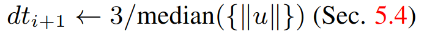
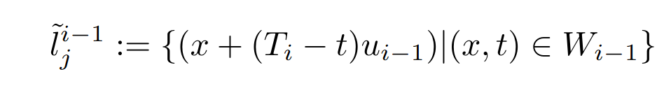

# Feature tracking and optical flow for the camera

## Overview
The first step for obtaining odometry with the event camera is to extract the velocity of moving objects in pixels per second within the 2D frame of the events. 

Why do we use this method?
1. Correcting feature drift 
2. Tracking features 
3. Produce more features from initial eFAST approach

## eFAST algorithm 
The eFAST corner detection algorithm is a lightweight, low latency corner detector meant for extracting intersecting edges. 

### What is an edge?
An edge denotes a spaital coordinate where there is multiple consecutive changes in polarity within a certain time threshold. An event denotes a single point that changes in polarity while an edge denotes multiple in a certain time window

### How are they detected using the eFAST algorithm?
For every event that comes in, two concentric rings are formed around that point where the points are examined if they have fired consecutively, they have formed an edge and corder because it is a circle, so it returns a boolean and the coordinate is recorded

You do not have to understand how the eFAST works because we already have code for it, this is just for simple background knowledge, the only thing to understand is that it returns a boolean and to mark down the coordinate in which it exists. 

## Key Definitions
Now, the part you have to understand: How do we use the initial feature detection from eFAST to track and make new ones?

We have to first understand a few concepts

### Feature
As said before, a feature represents an intersecting of edges within a window of firing pixels. These are used to track movement of the events without examining each event itself. This reduces the amount of compute we require with a lighter weight conversion, think of it as organization

### Optical Flow
Optical flow represents the local gradient of the features in respects to time and the position of the firing events. What this produces is a vector field of the local velocities of the features at each point a feature is created. This is to track where the feature is going in order to detect drift relative to the movement of the camera, and filter out "warped" or "smeared" events and extract what is only moving relative to the camera.

### Time Window
Each time we generate a local gradient with optical flow, we calculate a time window to track the feature through with the current flow value.

The time windows are iterated through [T<sub>i,</sub>, T<sub>i+1</sub>]. The iterator i is the current time window being evaluated. 

Within the window, there are n<sub>i</sub> events, iterated by k which exists from [0-n<sub>i</sub>]. 
The length of the time window is calculated as such:

!
### Landmark
A landmark represents an arbitrary object in a 3D space that the camera is observing. This is used to model the behavior of the global environment projected onto the camera. There is no deterministic way we can associate the physical landmark in the real world to the one presented in the camera, but we can model it with probability, which we will go over in the next section.

For each time window, after we calculate the feature, we calculate a projection of a 3D landmark through the previous flow claculated u<sub>i-1</sub>

The 2D projected landmark is represented by **l<sub>j</sub><sup>i−1</sup>**, where *i* represents the time window [T<sub>i</sub>, T<sub>i+1</sub>].

*k* is the iterator over the events in window *i*. There are *n<sub>i</sub>* events in each time window *i*, so *k* ranges over 0 … *n<sub>i</sub>*.

*j* is the iterator over the events in the **previous** window. It ranges over 0 … *n<sub>i−1</sub>*.

>"t" is the current timestamp associated with the k<sub>th</sub> event, and "x" is the position vector in x and y.


## Feature tracking algorithm
We have the concrete definitions from before, now we need to put them together

### Overview of the Algorithm and Block Diagram
The sequence of the algorithm is as follows:
1. eFAST initial feature generation
2. Initial optical flow estimate and landmark generation
3. Time window calculation
4. Probability fitting previous landmark with current optical flow and feature
5. New optical flow estimate of window
6. Use new optical flow for step 2 and continue from there until threshold is reached

### Step one: eFAST Initial Feature Generation
Think of this as a black box: If a feature is discovered with eFAST, we use this as our initial estimate of the feature before detection, we take the coordinates that return from this and use it for tracking

### Step two: Initial Optical Flow estimate and Landmark Generation
When i=0, we do not have an optical flow estimate so we use u<sub>0</sub> = 0. We also use this for l<sub>0</sub><sup>0</sup> for the landmark. 

If i does not equal zero, we use the optical flow calculated from step 5 from window i-1, and we generate the landmark with the optical flow from step 2 of i-1, or step 5 of i-2. The optical flow u<sub>i</sub> is always stated to be the optical flow generated from step 5 of i-1. 


### Step 3: Time Window Calculation:
When i=0, we define the window to a sufficient amount of events such that we can do a "good" initial estimate in step 5. say, 50k events  

Otherwise, we use the median formula here to calculate the window size


### Find the Probability that Previous Landmark correlates with current feature
Now we need to find the probability that the previous landmark correlates with the current flow/feature f<sub>i</sub> and u<sub>i</sub>. 


### Updating Optical Flow
Once we have everything we need: landmarks, current flow, probability and time window, we can update the optical flow using this equation

graph TD
    %% Styling
    classDef input fill:#e1f5fe,stroke:#0288d1,stroke-width:2px,color:#000
    classDef process fill:#f1f8e9,stroke:#689f38,stroke-width:2px,color:#000
    classDef align fill:#ffebee,stroke:#d32f2f,stroke-width:2px,color:#000
    classDef output fill:#f3e5f5,stroke:#7b1fa2,stroke-width:2px,color:#000
    classDef default fill:#fff,stroke:#333,stroke-width:1px,color:#000

    ```mermaid
graph TD
    %% Styling
    classDef input fill:#e1f5fe,stroke:#0288d1,stroke-width:2px,color:#000
    classDef process fill:#f1f8e9,stroke:#689f38,stroke-width:2px,color:#000
    classDef align fill:#ffebee,stroke:#d32f2f,stroke-width:2px,color:#000
    classDef output fill:#f3e5f5,stroke:#7b1fa2,stroke-width:2px,color:#000
    classDef default fill:#fff,stroke:#333,stroke-width:1px,color:#000

    %% Inputs
    subgraph INPUTS [ALGORITHM 2 INPUTS]
        E["Raw Events Stream<br>e_i = (x_i, y_i, t_i, p_i)"]:::input
        F["Active Features<br>ID, f(T_i), u_{i-1}, T_i"]:::input
        T["Associated Templates<br>1. Original Master<br>2. Most Recent"]:::input
    end

    %% Process Loop
    subgraph LOOP [TRACKING LOOP (For each feature)]
        B1["<b>1. Window Extraction</b><br>Calculate Δt = k / ||u||²<br>Crop local events<br><i>Output: W_i</i>"]:::process
        B2["<b>2. Optical Flow Estimation</b><br>Expectation-Maximization (EM)<br>Solve for data association α(k)<br><i>Output: New velocity u(t)</i>"]:::process
        B3["<b>3. Kinematic Update</b><br>f(t) = f(T_i) + (t - T_i)u(t)<br><i>Output: Raw Predicted Position</i>"]:::process
        B4["<b>4. Template Alignment</b><br>Correct drift using W(x; p)<br>Align to Most Recent & Master<br><i>Output: Final Corrected Position</i>"]:::align
        B5["<b>5. State Update</b><br>Overwrite feature memory<br>Save W_i as new Recent Template"]:::output
    end
    
    %% EKF Output
    EKF["<b>Extended Kalman Filter (EKF)</b><br>Update 3D Map"]:::default

    %% Connections
    E --> B1
    F --> B1
    B1 --> B2
    B2 --> B3
    B3 --> B4
    T -.->|Drift Correction| B4
    B4 --> B5
    
    %% Feedback & Handoff
    B5 -->|Feedback Loop to next T_i| F
    B5 ===>|Handoff tracked history| EKF
